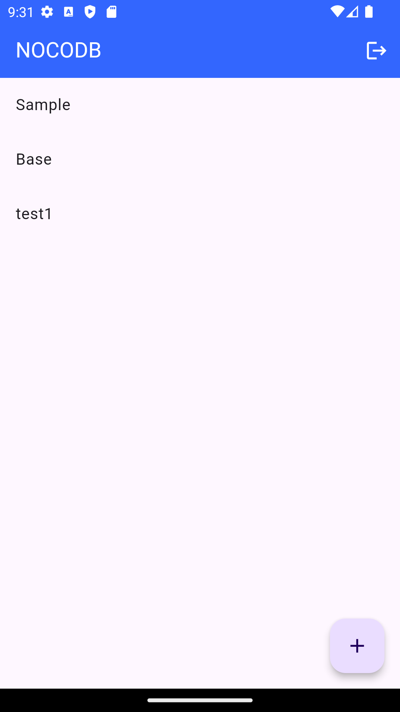
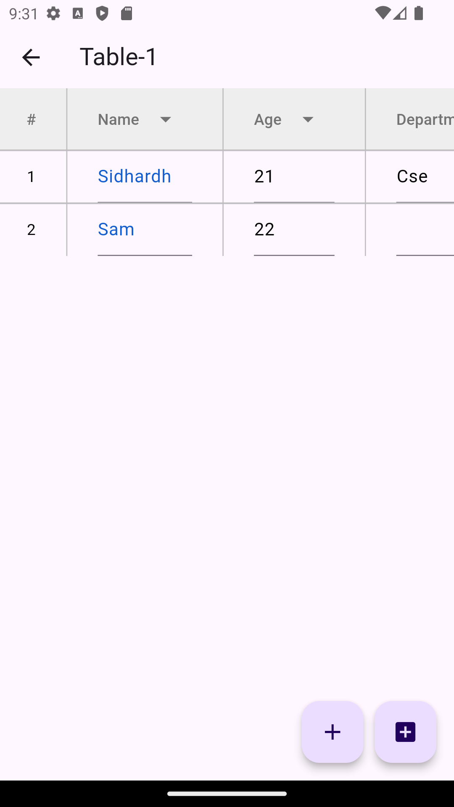
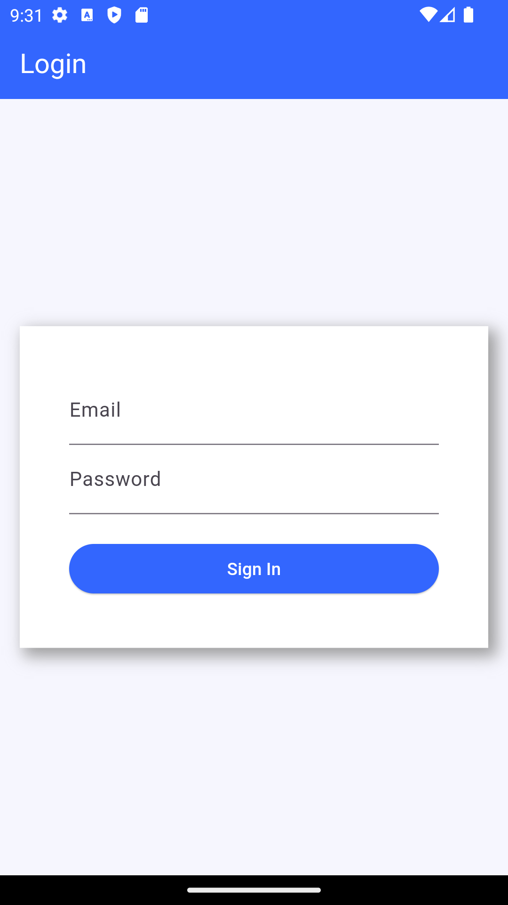

# NocoDB App

## Build Databases as Spreadsheets: No Coding Required

NocoDB App empowers you to create no-code database solutions while maintaining the simplicity and familiarity of spreadsheets. Whether you're building a custom database for personal projects or enterprise-level solutions, NocoDB App puts you in control of your data without writing a single line of code.

---

## Features

- **No-Code Database Building**
  Create and manage databases effortlessly, like editing a spreadsheet.

- **Bring Your Own Database**
  Connect with existing databases or use our built-in solution.

- **Scalable for Millions of Rows**
  Easily handle large datasets without compromising performance.

- **Data Ownership and Control**
  Your data stays in your hands. Define your own rules for access and modification.

- **Customizable Columns & Rows**
  Add, edit, or delete rows and columns dynamically with real-time updates.

- **Interactive User Interface**
  Modern UI with features like dialogs, popups, and dynamic content, ensuring a smooth user experience.

---

## How It Works

### 1. Add Rows & Columns
Effortlessly add new rows and columns to your database with the click of a button. Customize column names, and all changes are saved in real-time.

### 2. Edit Data in Real-Time
Click on any cell to update its content instantly. No manual refreshes or additional steps required.

### 3. Delete Records Safely
Use built-in dialogs to confirm row or column deletions, avoiding accidental data loss.

---

## Tech Stack

- **Flutter**: Cross-platform mobile application framework for building interactive user interfaces.
- **Cloud**: Cloud database for data storage.
- **Dart**: Programming language used for Flutter development.

---

## Installation

1. Clone this repository:
   ```bash
   git clone https://github.com/SidhardhCR/nocodb_app---1.git
   cd nocodb-app-1
   ```

2. Install dependencies:
   ```bash
   flutter pub get
   ```

3. Run the app:
   ```bash
   flutter run
   ```

4. Enjoy building your database with NocoDB App!

---

## Screenshots

### 1. Main Interface
A clean and intuitive interface for managing your data:



### 2. Table Screen
Quickly create new columns with customizable names:



### 3. Login Page
Edit rows directly with an intuitive text field:



---

## Contributing

We welcome contributions to improve the NocoDB App! Here's how you can help:

1. Fork this repository.
2. Create a new branch:
   ```bash
   git checkout -b feature/your-feature-name
   ```
3. Make your changes and commit them:
   ```bash
   git commit -m "Add your commit message here"
   ```
4. Push to your branch:
   ```bash
   git push origin feature/your-feature-name
   ```
5. Submit a pull request.

---

## Contact

For questions, suggestions, or feedback, please contact:

**Your Name**  
Email: sidhardhcr007@gmail.com 
GitHub: [SidhardhCR](https://github.com/SidhardhCR)

---

Start building your database as easily as managing a spreadsheet. No coding required, just possibilities!


